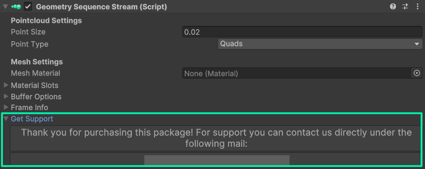

#### ⭐ Direct support (Unity Asset Store version)

If you've bought the package on the Unity Asset Store, you can contact us directly via email for fast and direct support. You can find the email address in the **Geometry Sequence Stream component** under the **Get Support** foldout. 

#### General support

For any questions regarding the package, tips, or errors that are occurring, please feel free to ask anything in our [Unity Forums thread](https://forum.unity.com/threads/released-geometry-sequence-streaming.1453765/).

Bugs and issues can also be reported [here in the main Github repository](https://github.com/BuildingVolumes/Unity_Geometry_Sequence_Streaming/issues) 🪲

>💡 Do a quick search first, if your issue has already been reported. If not, please open a new one, and we'll get back to you!
