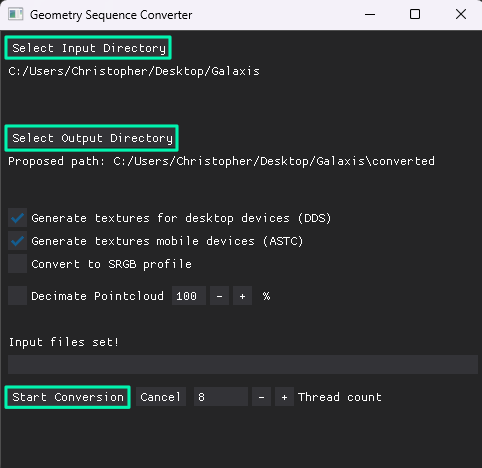

> ⤴️ Sequences that were created before package version 1.1.0 are not compatible with the current package. Please re-convert these files with the latest Converter.

## Conversion

1. Ensure that in your input sequence, each frame file is numbered in an ascending order

2. Almost all commonly used pointcloud (.ply, .xyz), mesh (.fbx .obj .gltf) and image (.jpeg .png .tga) formats can be used as source material. Ensure that your sequence is in such a format

3. Download the latest converter [binaries for windows here](https://github.com/BuildingVolumes/Unity_Geometry_Sequence_Streaming/releases) (The file named Geometry_Sequence_Converter_Win64.zip)

4. Unzip, open the converter, and set the **input folder** to the folder containing your sequence. You can optionally set an output folder, otherwise a new folder will be automatically created. Click on **Start Conversion**.

    

[More infos](/Unity_Geometry_Sequence_Streaming/docs/tutorials/preparing-your-sequences/)

## Playback in Unity

1. Open your project and scene in Unity.

2. Add a **GeometrySequencePlayer** component to any gameobject.

3. Click on **Open Sequence** and open the ***sequence.json*** file contained in the converted sequence folder (the output folder).

4. Click on Play in Unity.
