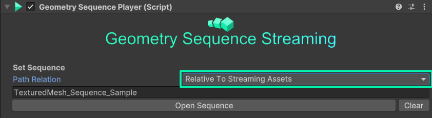
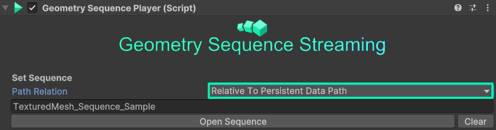

## Build and ship

If you intent to distribute your Application built with the Unity Geometry Sequence Streamer, you need to consider where you store your geometry sequence.
In Unity, you need to store all assets loaded at runtime in a [**Streamingassets**](https://docs.unity3d.com/Manual/StreamingAssets.html) folder ([exept for Android Builds](/Unity_Geometry_Sequence_Streaming/docs/tutorials/distribution/#android)), located inside of the Asset path root, and store all geometry sequences in there. This folder will be copied into your build as-is.

1. Inside of the Unity project view, go to the "Assets" folder and create a **Streamingsassets** folder there:

    

2. Copy all your geometry sequences inside of this folder

3. In your Geometry Sequence Player, either set the sequence via **Open Sequence** and then choose the folder inside of your streamingassets path *or* set the **Path Relation** to **Relative to Streamingassets** and then enter the path to your sequence, relative to the Streamingassets folder:

    

4. Test your changes and path in playmode, then you can build and distribute your application as usual.

## Android

On Android, the StreamingAssets path is a special case. Data stored into this path, will be compressed into the .apk and needs to be decompressed on load. For large files, like geometry sequences, this will make a noticable impact on playback performance, therefore we don't support the Streamingassets path. On Android, you have to use the applications [**Persistent Data Path**](https://docs.unity3d.com/ScriptReference/Application-persistentDataPath.html). The persistent data path is a special path, reserved for application data on the device. Unlike the StreamingAssets path, Unity won't copy your files automatically to the persistent data path, instead, you have to **copy them manually**, or on distribution in the Play Store, let your application download them from a server.

> ⚠️The persistent data path will only be generated on the applications first run on the device. So you need to run the application once, then copy the files and then run the application again, or let the app download the files onto the device before the Geometry Sequence Player runs.

1. Inside of your Geometry Sequence Player, set the **Path Relation** to **Relative to Persisten Data Path** and enter the relative path in which you later want to store your sequence, in this example we choose *"Sequence/MySequence"*.

    

2. Build the android app, install it on your Android device and run it, then quit the app. The Geometry Sequence won't be playing at this point.

3. Connect your device to your PC via USB, enable File transfer and then go to the following path on the device:
*"\Android\data\com.myCompanyName.myProductName\files"*. This is your applications **Persistent Data Path**.

4. Copy your sequence files in the same relative path you set in the Geometry Sequence Player. In our example, the geometry files would be copied into this folder *"\Android\data\com.myCompanyName.myProductName\files\Sequence\MySequence"*

5. Now run your app again, you should now see the sequence streaming successfully.
