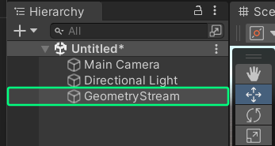
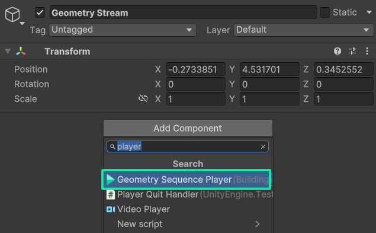
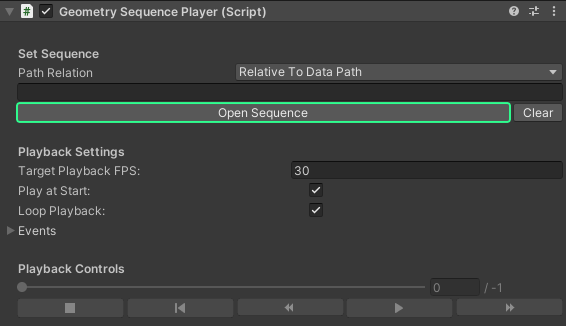
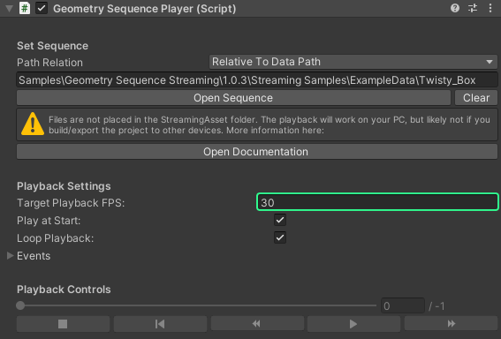
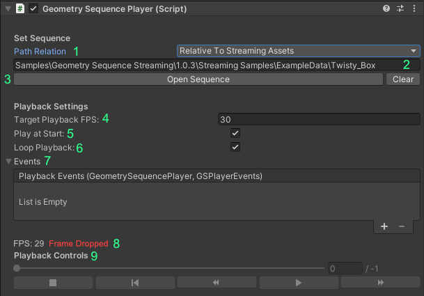
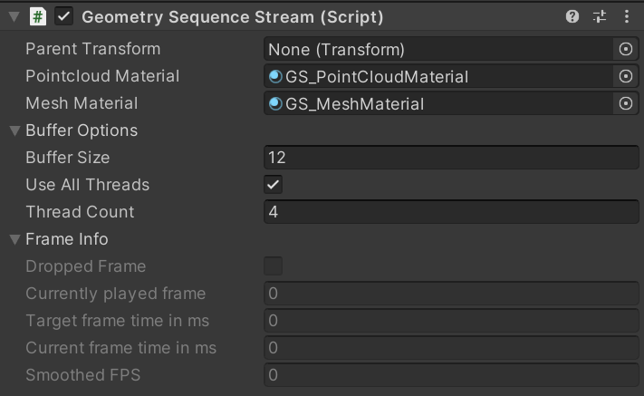

## Intro

> 💡 All of the features explained here in this tutorial can also be found in the Sample Scene [01_Basic_Example](/Unity_Geometry_Sequence_Streaming/docs/tutorials/unity-package-installation/#importing-the-samples-optional)

After you've prepared and converted your sequence, you can now play them back in Unity! This section shows you how to use the streaming and playback components inside of the editor and how to setup a simple playback scene.

## Playback

1. Open your Unity scene in which you want to implement the playback. We recommend that you create a new Gameobject, onto which you can attach the playback components, but you can use any Gameobject of your choice.

2. In the inspector, click on **"Add Component"**, search for **"Geometry Sequence Player"** and add this component.

3. You should now see a Geometry Sequence Player and Geometry Sequence Stream component attached to your Gameobject. Click on **"Open Sequence"** in the Player script, and open the  **sequence.json** from the folder in which your converted sequence is stored. It is strongly recommended to store your sequence on the fastest drive available, preferably an SSD.
    > ⚠️ When you're just testing, or you don't intent to distribute your app to other PCs than your own, it's fine to store the sequence anywhere on disk. However, if you plan to distribute your application, [please take a look here](/Unity_Geometry_Sequence_Streaming/docs/tutorials/distribution)!
  
    

4. The first frame of your sequence should now appear in the scene / game view. If you can't see anything, try pressing ***F*** to focus on your sequence. Sometimes, it might be scaled surprisingly small or large.

5. Set the **playback framerate** of your sequence. The framerate is not automatically detected, so you need to set it every time. The default is 30 FPS.

6. Click Play. Your sequence should automatically start playing back once the play mode has been entered!

## Controls & Settings explained

Detailed explanation of all the settings and controls inside of the player and stream scripts

### Player component

**Path relation:** Choose if your path to the sequence is relative to the [Data path](https://docs.unity3d.com/ScriptReference/Application-dataPath.html), [Persistent Data Path](https://docs.unity3d.com/ScriptReference/Application-persistentDataPath.html), [Streaming Assets path](https://docs.unity3d.com/Manual/StreamingAssets.html), or is an **absolute path**. This gets set automatically if you open a sequence with the **Open Sequence** button. If you enter the path yourself, you need to set this field manually!

**Path to sequence:** Enter your relative or absolute path to the folder containing the sequence

**Open Sequence / Clear Sequence:** Use the file explorer to choose the folder where your converted sequence is located, or clear the path from the player.

**Target Playback FPS:** This is the framerate at which you want to playback your sequence.

**Play at Start:** Should the playback of the sequence start directly when the scene is started/you entered play mode? If deactivated, you need to start the sequence manually via script or the editor controls.

**Loop playback:** If activated, repeats the animation indefinitely

**Events:** With this Unity Event control, you can assign scripts that should receive events from the player. [More on Events](/Unity_Geometry_Sequence_Streaming/docs/tutorials/scripting-api/#events)

**Playback controls:** Use the slider to skip to any time in the sequence, just like in a regular video player. On the right, you can see at which frame the playback is right now, and how many frames there are in total in the sequence. Use the **|<** Button to go back to the start of the sequence, the **<<** and **>>** to scroll forwards/backwards for a few frames, the **Stop** Button to stop playback and the **Play/Pause** button to pause/resume the playback. These controls are only available in the editor.

### Stream component

**Pointcloud Settings:** These settings only affect pointcloud based sequences.

- **Point Size:** Set the size of the individual points with the  modifier (in Unity units).
- **Point Type:** Set the shape of the points. They can either be displayed as **Quads**, **Circles** or **Splats** (experimental, not recommended)**.

**Mesh Settings:** These settings only affect mesh based sequences.

- **Mesh Material:** Set an alternative material for your mesh sequence. If left empty, a default unlit material will be used.
- **Material slots:** Set to which material slots the texture of your sequence should apply. Options are **Main texture**, **Emissive** and **Detail**
- **Custom texture slots:** If the material should apply to other slots, add them here. Add the name of the texture slot as defined in the shader.

**Buffer options:** Advanced settings for optimizing the performance, especially in regard to the playback buffer.

- **Buffer Size:** The higher the buffer size, the more frames are preloaded. Increasing this value can improve playback performance, at the cost of higher memory usage.
- **Use All Threads:** All worker threads can be used by the streamer. If you use other scripts heavily dependent on the job system, you can try to disable this option to free some threads, at the cost of playback performance
- **Thread Count:** If **Use all threads** is disabled, you can set the amount of threads used by the playback system here. More threads usually increase performance.

**Frame Info:** Various performance metrics

**Frame Debugger:** If your sequence doesn't perform well, or as expected, you can use the frame debugger to analyze the playback performance.

- **Attach Debugger (Editor only):** Enable this option, to show the frame debugger on screen when the sequence is playing. Only works in the Editor
- **Manually attach debugger:** You can optionally use the **GSFrameDebugger Prefab** found in the package files to manually place the frame debugger in your scene. Helpful in case you need to place it in the world space, or in your XR scenes. By setting this value, you attach the debugger to your sequence.
