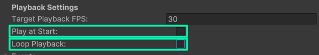
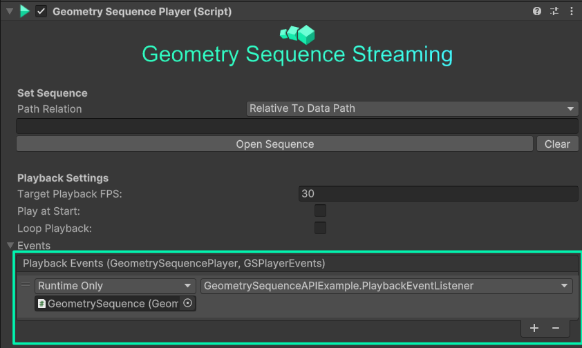

> 💡 All of the features explained here in this tutorial can also be found in the Sample Scene [03_API_Example](/docs/tutorials/unity-package-installation/#importing-the-samples-optional)

## Intro

Beside playback from timeline and in the editor, this package also allows you to control playback from your own scripts. This is useful, if you have for example playback control by the user via UI buttons, or you want interactivly integrate playback inside your application.

## Setup

To use the Scripting API, you need to have a gameobject in the scene that has the **Geometry Sequence Player** and **Geometry Sequence Stream** components attached to it.

First, include the BuildingVolumes namespace inside your script with:

```C#
using BuildingVolumes.Streaming;
```

In your script, you then have to get the **Geometry Sequence Player** component, ideally directly in the start function:

```C#
void Start()
    {
        //Get our player.
        player = GetComponent<GeometrySequencePlayer>();
    }
```

Then, we recommend that you disable **Play at Start** and **Loop Playback** either directly through the editor inside of the **Geometry Sequence Player** component:



or via script inside of the start function. This ensures that you have full control over when and how you want to play your sequence.

```C#
void Start()
    {
        //Get our player.
        player = GetComponent<GeometrySequencePlayer>();

        //Disable automatic looping and automatic playback.
        player.SetLoopPlay(false);
        player.SetAutoStart(false);
    }
```

You can the load your sequence with the **OpenSequence()** function at any point:

```C#
//Load our sequence, set its framerate to 30 and play it directly after loading
player.OpenSequence("C:\MySequences\MyOwnSequence\", GeometrySequencePlayer.PathType.AbsolutePath, 30, true);
```

👉 For an overview about the API Features, take a look at the [Scripting Reference](/docs/tutorials/scripting-api/#scripting-reference)

## Events

Events can be used to react to certain actions of the Playback, such as when Playback has started, stopped, or buffering has finished.
To receive an event, you need to define a function in your code, which can receive a `GeometrySequencePlayer` object and a `GeometrySequencePlayer.GSPlayerEvents` enum. Use the `GSPlayerEvents` enum to receive the information which event has been triggered, and the player object to determine which player has fired the event.

```C#
//A sample event receiver
public void PlaybackEventListener(GeometrySequencePlayer player, GeometrySequencePlayer.GSPlayerEvents events)
    {
        switch (events)
        {
            case GeometrySequencePlayer.GSPlayerEvents.PlaybackFinished:
                print("Playback Finished!");
                break;
            case GeometrySequencePlayer.GSPlayerEvents.PlaybackStarted:
                print("Playback Started!");
                break;
        }
    }
```

To actually receive the events, you need to subscribe to them. You can either do this by adding a reference to your function inside the GeometrySequencePlayer **in the editor**, or subscribing to a Players events **inside your script (recommended)**.

&nbsp;

**Subscribe via Editor:**
To subscribe to events via the Editor, go to your GeometrySequencePlayer into the events foldout, click on **+** and drag and drop your script into the event subscription box. Now, select your function.



&nbsp;

**Subscribe via Code:**
To subscribe to an event via code, get a reference to the player you want to subscribe to, and then add a Listener to the event. Dont forget to unsubscribe when the script gets destroyed/disabled!

```C#

void Start()
{
    //Get our player reference
    player = GetComponent<GeometrySequencePlayer>();

    //Subscribe to the player events
    player.playbackEvents.AddListener(PlaybackEventListener);
}

//Event receiver
void PlaybackEventListener(GeometrySequencePlayer player, GeometrySequencePlayer.GSPlayerEvents events)
{
    //Do stuff with your event
}

void OnDisable()
{
    player.playbackEvents.RemoveListener(PlaybackEventListener);
}

```

## Scripting Reference

### OpenSequence()

`OpenSequence(string path, PathType relativeTo, float playbackFPS , (optional) bool autoplay = false, (optional) bool buffer = true)`
Loads a sequence from the specified path, and start playback if autoplay is enabled.
Parameters:

- `path`: The relative or absolute path to the folder containing the directory. Should end with a slash
- `relativeTo`: Is the path relative to the [Data path](https://docs.unity3d.com/ScriptReference/Application-dataPath.html), [Persistent Data Path](https://docs.unity3d.com/ScriptReference/Application-persistentDataPath.html), [Streaming Assets path](https://docs.unity3d.com/Manual/StreamingAssets.html), or is an absolute path?
- `playbackFPS`: The framerate in which your animated sequence was exported in.
- `autoplay` : Optional parameter, start playback directly after it has been loaded
- `buffer` : Optional parameter, immediately start buffering the first frames of the sequence after opening it

Returns:

- **True** when sequence could successfully be loaded, **false** when an error has occured while loading. Take a look in the Unity console in this case

### LoadCurrentSequence()

`LoadCurrentSequence((optional) bool autoplay = false, (optional) bool buffer = true)`
(Re)loads the sequence which is currently set in the player, optionally starts playback.

- `autoplay` : Optional parameter, if set to true, playback starts directly after it has been loaded
- `buffer` : Optional parameter, immediately start buffering the first frames of the sequence after opening it

Returns:

- **True** when sequence could successfully be loaded, **false** when an error has occured while loading. Take a look in the Unity console in this case

### SetPath()

`SetPath(string path, PathType relativeTo)`
Set a new path in the player, but don't load the sequence. Use `LoadCurrentSequence()` to actually load it, or LoadSequence() to do both at once.
Parameters:

- `path`: The relative or absolute path to the folder containing the directory. Should end with a slash
- `relativeTo`: Is the path relative to the [Data path](https://docs.unity3d.com/ScriptReference/Application-dataPath.html), [Persistent Data Path](https://docs.unity3d.com/ScriptReference/Application-persistentDataPath.html), [Streaming Assets path](https://docs.unity3d.com/Manual/StreamingAssets.html), or is an absolute path?

### Play()

`void Play()`
Start Playback from the current location.

### Pause

`void Pause()`
Pause current playback

### Stop

`void Stop()`
Stops the current playback, and resets the player to the first frame

### SetLoopPlay()

`void SetLoopPlay(bool enabled)`
Activate or deactivate looped playback

Parameters:

- `enabled` : Set to true/false to enable/disable looped playback

### SetAutoStart()

`void SetAutoStart(bool enabled)`
Activate or deactivate automatic playback (when the scene starts)

Parameters:

- `enabled` : Set to true/false to enable/disable automatic playback when the scene has started

### PlayFromStart()

`bool PlayFromStart()`
Seeks to the start of the sequence and then starts playback

Returns:

- `True`, when the sequence could be started from the beginning `False` when there has been an error.

### GoToFrame()

`bool GoToFrame(int frame)`
Goes to a specific frame. Use GetTotalFrames() to check how many frames the clip contains

Parameters:

- `enabled`

Returns:

- `True` when skipping was successfull `False` if there has been an error, or the desired frame index was out of range

### GoToTime()

`void GoToTime(float timeInSeconds)`
Goes to a specific time in  a clip. The time is dependent on the framerate e.g. the same clip at 30 FPS is twice as long as at 60 FPS.

Parameters:

- `timeInSeconds` : The desired timestamp of the sequence to which you want to jump.

### Hide()

`void Hide()`
Hides the currently playing mesh sequence (disables the mesh renderer). The sequences will continue playing.

### Show()

`void Show()`
Shows the currently playing mesh sequence (enables the mesh renderer).

### GetAbsoluteSequencePath()

`string GetAbsoluteSequencePath()`
Gets the absolute path to the folder containing the sequence

Returns:

- The absolute path to the Sequence currently used

### GetRelativeSequencePath()

`string GetRelativeSequencePath()`
Gets the relative path to the folder containing the sequence. Use `GetRelativeTo()` to see which path it is relative to.

Returns:

- The relative path to the Sequence currently used, relative to the path in `GetRelativeTo()`

### GetRelativeTo()

`GeometrySequenceStream.PathType GetRelativeTo()`
Get the location to to which the relativePath is relative to. Use [Application.datapath](https://docs.unity3d.com/ScriptReference/Application-dataPath.html), [Application.persistentDataPath](https://docs.unity3d.com/ScriptReference/Application-persistentDataPath.html) or [Application.streamingAssetsPath](https://docs.unity3d.com/Manual/StreamingAssets.html) to get the actual path string, depeding on the return type.

Returns

- The relative location

### IsPlaying()

`bool IsPlaying()`
Is the current clip playing?

Returns:

- `True` if the clip is playing `False` if it is paused, stopped or not loaded

### GetLoopingEnabled()

`bool GetLoopingEnabled()`
Is looped playback enabled?

Returns:

- `True` if the playback is enabled `False` if it is disabled

### GetCurrentFrameIndex()

`int GetCurrentFrameIndex()`
At which frame is the playback currently?

Returns:

- The frame index which is currently being played/shown

### GetCurrentTime()

`float GetCurrentTime()`
At which time is the playback currently in seconds?
Note that the time is dependent on the framerate e.g. the same clip at 30 FPS is twice as long as at 60 FPS.

Returns:

- The current timestamp of the clip in seconds

### GetTotalFrames()

`int GetTotalFrames()`
How many frames are there in total in the whole sequence?

Returns:

- The total number of frames in the sequence

### GetTotalTime()

`float GetTotalTime()`
How long is the sequence in total?
Note that the time is dependent on the framerate e.g. the same clip at 30 FPS is twice as long as at 60 FPS.

Returns:

- The length of the sequence in seconds

### GetTargetFPS()

`float GetTargetFPS()`
The target fps is the framerate we _want_ to achieve in playback. However, this is not guranteed, if system resources
are too low. Use GetActualFPS() to see if you actually achieve this framerate

Returns:

- The playback framerate used currently for this clip

### GetActualFPS()

`float GetActualFPS()`
What is the actual current playback framerate? If the framerate is much lower than the target framerate,
consider reducing the complexity of your sequence, and don't forget to disable any V-Sync (VSync, FreeSync, GSync) methods!

Returns:

- The actual FPS at which your sequence is playing.

### GetFrameDropped()

`bool GetFrameDropped()`
Check if there have been framedrops since you last checked this function. You should pull this data every frame.
Too many framedrops mean the system can't keep up with the playback
and you should reduce your Geometric complexity or framerate.

Returns:

- `True` When there has been a frame dropped since the last time you checked it, `False` if there has been no framedrop

### GetCacheFilled()

`bool GetCacheFilled()`
Checks if the playback cache has been filled and is ready to play.
