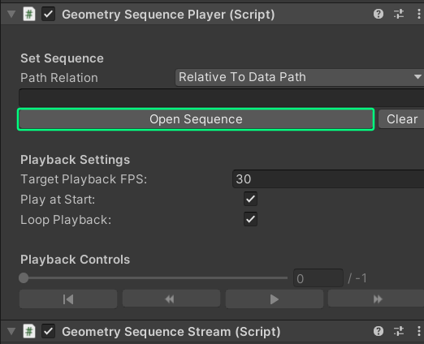
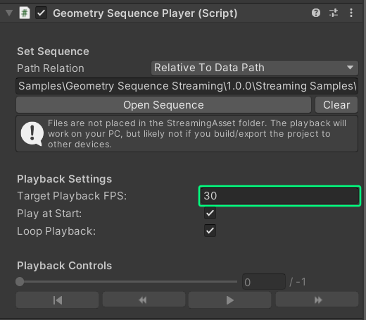

## Intro

> 💡 All of the features explained here in this tutorial can also be found in the Sample Scene [01_Basic_Example](/docs/tutorials/installation/#importing-the-samples-optional)

After you've prepared and converted your sequence, you can now stream them from your disk right into Unity! This section shows you how to use the streaming and playback components inside of the editor, to setup a simple playback scene.

## Playback

1. Open your Unity scene in which you want to implement the playback. We recommend that you create a new gameobject, onto which you can attach the streaming and playback scripts/components, but you can use any gameobject of your choice.

2. In the inspector, click on **"Add Component"**, search for **"Geometry Sequence Player"** and add this component.

3. You should now see a Geometry Sequence Player and Geometry Sequence Stream component attached to your gameobject. Click on **"Open Sequence"** in the Player script, and then open the folder, in which your converted sequence is stored.
    > ⚠️ When you're just trying out playback on your machine, or you don't intent to distribute your app to other PCs, it's fine to store the sequence anywhere on disk. However, if you plan to distribute your application, [please take a look here](/docs/tutorials/distribution)!
  
    

4. Set the **playback framerate** of your sequence. This should be the same framerate in which your animated sequence was exported.

5. Click Play. You should now see your sequence playing back inside of your scene. If you don't see anything, it might simply be because your camera is not looking at the sequence. Go to the scene window, select the "Streamed Mesh" Gameobject and press **"F"** to focus on it.

## Controls & Settings explained

Detailed explanation of all the settings and controls inside of the player and stream scripts

### Player component

#### Path relation

Choose if your path to the sequence is relative to the [Data path](https://docs.unity3d.com/ScriptReference/Application-dataPath.html), [Streaming Assets path](https://docs.unity3d.com/Manual/StreamingAssets.html) or is an absolute path. This gets set automatically if you open a sequence with the **Open Sequence** button. If you enter the path yourself, you also need to set this field!

#### Path to sequence

Enter your relative or absolute path to the folder containing the sequence

#### Open Sequence / Clear Sequence

Use the file explorer to choose the folder where your converted sequence is located, or clear the path from the player.

#### Target Playback FPS

This is the framerate at which you want to playback your sequence. It's important that this is set to the same framerate that you used while animating/capturing your sequence, as it also effects playback speed. E.g. if you exported your sequence at 30 FPS, but set the playback framerate to 60 FPS, the sequence will play twice as fast.

#### Play at Start

Should the playback of the sequence start directly when the scene is started/you entered play mode?

#### Loop playback

If activated, repeats the animation indefinitly

#### Actual FPS / Frame drop

This is the actual framerate at which the sequence plays back. If you either see a framerate lower than your target playback FPS, or see lot's of "Frame Dropped!" warning messages, this means that your system doesn't have enough resources to playback the sequence at it's intendet speed. You can either reduce the geometric complexity of your sequence, reduce the texture size, or upgrade your system.

#### Time slider

Use this slider to skip to any time in the sequence, just like in a regular video player. On the right, you can see at which frame the playback is right now, and how many frames there are in total in the sequence. The slider is only available in the editor.

#### Playback controls

Use the **|<** Button to go back to the start of the sequence, the **<<** and **>>** to scroll forwards/backwards for a few frames, and the **Play/Pause** button to pause/resume the playback. These buttons are only available in the editor.

### Stream component

#### Parent Transform

You can attach the streamed mesh onto a parent gameobject, which you can use to place, scale, and rotate your streamed mesh.

#### Pointcloud Material

Set an alternative material that is used for displaying pointclouds. If left empty, the supplied default material will be used. Please note that pointclouds **cannot use standard Unity Materials/Shaders!** You need to use a special Pointcloud shader, like the one provided in the package.

#### Mesh material

Set an alternative material that is used for displaying pointclouds. If left empty, the supplied default material will be used.

#### Buffer options

- **Buffer size**
This size sets how many frames the streaming service will load from disk and store in a buffer in advance of the playback. A larger buffer might provide a smoother playback, however it also uses more memory and skipping/restarting playback might take longer, as the buffer needs to be flushed.

- **Use all threads**
Should the Unity Job system which is responsible for streaming use all available threads? If you deactive this, you can set the thread count yourself, but note that it will also effect other scripts that might use the job system!

- **Thread count**
Set how many threads the job system should use. Is only used the **Use all threads** is deactivated. Will also effect other scripts that might use the job system!

**Frame Info**
This foldout contains read-only frame information. Used only for debugging.
